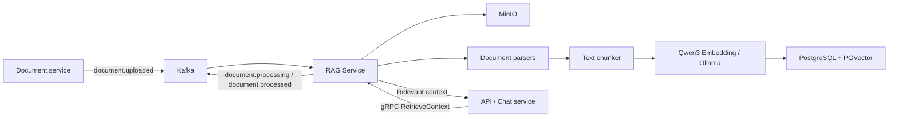

# NotebookLM RAG Service

The NotebookLM **Retrieval-Augmented Generation (RAG)** service. It consumes document-upload events from Kafka, downloads files from MinIO, extracts and chunks their text, creates Qwen3 embeddings, and stores them in PostgreSQL + PGVector. Other services retrieve relevant context over gRPC for chat and LLM workflows.

> [!IMPORTANT]
> Every retrieval request must be scoped by `project_id` and the allowed `document_ids`. This provides project-level data isolation at the retrieval layer.

## Table of Contents

- [Architecture](#architecture)
- [Capabilities](#capabilities)
- [Document Processing Flow](#document-processing-flow)
- [Requirements](#requirements)
- [Configuration](#configuration)
- [Running the Service](#running-the-service)
- [gRPC API](#grpc-api)
- [Kafka Events](#kafka-events)
- [Development](#development)
- [Troubleshooting](#troubleshooting)

## Architecture



Main components:

| Component | Responsibility |
| --- | --- |
| `messaging/` | Kafka consumer/producer with inbox-table-based idempotency. |
| `storage/` | Reads objects and metadata from MinIO. |
| `rag/parsers/` | Extracts text from PDF, Word, Excel, PowerPoint, and plain-text files. |
| `rag/chunk/` | Splits content into chunks using configurable size and overlap. |
| `rag/embeddings/` | Calls an OpenAI-compatible endpoint to generate Qwen3 embeddings. |
| `rag/langchain_rag.py` | Persists vectors and performs semantic search through LangChain PGVector and JSONB metadata filters. |
| `rpc/` | gRPC server and `RetrievalService` used for chat context retrieval. |

## Capabilities

- Consumes and processes `document.uploaded` events from Kafka.
- Reads source documents from MinIO using `objectKey`.
- Supports `.pdf`, `.docx`, `.xlsx`, `.pptx`, UTF-8 text, and legacy Office formats (`.doc`, `.xls`, `.ppt`) through LibreOffice.
- Attaches metadata to every chunk: `project_id`, `document_id`, `user_id`, filename, content type, object key, size, ETag, and last-modified timestamp.
- Generates embeddings with `qwen3-embedding:0.6b` (1024 dimensions by default).
- Stores vectors in PostgreSQL with PGVector and performs filtered semantic search through JSONB metadata.
- Returns project- and document-scoped context over gRPC.
- Publishes `document.processing` (`PROCESSING`, `COMPLETED`) and `document.processed` events after successful indexing.

## Document Processing Flow

1. The Document service uploads a file to MinIO and publishes a `document.uploaded` event to Kafka.
2. `DocumentUploadedHandler` checks the `eventId` in the inbox table. Previously processed events are skipped.
3. The service publishes `document.processing` with status `PROCESSING`.
4. The file is downloaded from MinIO; a parser is selected by filename extension or `content_type`.
5. The extracted text is split using `RAG_CHUNK_SIZE` and `RAG_CHUNK_OVERLAP`.
6. Each chunk is embedded and stored in PGVector together with project, document, and user metadata.
7. The service publishes `document.processed` with the chunk count, then publishes `document.processing` with status `COMPLETED`.

## Requirements

- Python **3.11+**
- [uv](https://docs.astral.sh/uv/)
- Docker and Docker Compose (recommended for the complete dependency stack)
- The external `notebook-lm` Docker network, normally created by the shared infrastructure stack
- Kafka and MinIO reachable from the `notebook-lm` network

Create the network if it does not exist in your local environment:

```bash
docker network create notebook-lm
```

## Configuration

Create the environment file from the template:

```bash
cp .env.example .env
```

| Variable | Default/example | Description |
| --- | --- | --- |
| `KAFKA_BOOTSTRAP_SERVERS` | `kafka:9092` | Kafka bootstrap servers. |
| `KAFKA_CONSUMER_GROUP` | `rag-service` | Consumer group that processes documents. |
| `DATABASE_URL` | `postgresql://…/rag_service` | Database used for inbox/idempotency records. |
| `MINIO_ENDPOINT` | `http://minio:9000` | MinIO endpoint. |
| `MINIO_ROOT_USER` | `minioadmin` | MinIO access key. |
| `MINIO_ROOT_PASSWORD` | `minioadmin` | MinIO secret key. |
| `MINIO_BUCKET` | `notebook-lm` | Bucket containing source files. |
| `QWEN3_EMBEDDING_BASE_URL` | `http://embedding:11434/v1` | Ollama's OpenAI-compatible embedding endpoint. |
| `QWEN3_EMBEDDING_MODEL` | `qwen3-embedding:0.6b` | Embedding model. |
| `QWEN3_EMBEDDING_DIMENSIONS` | `1024` | Vector dimensions; must match the model and collection. |
| `RAG_DATABASE_URL` | `postgresql://…/rag_service` | PGVector connection string. |
| `RAG_COLLECTION_NAME` | `rag_documents` | PGVector collection name. |
| `RAG_CHUNK_SIZE` | `1000` | Maximum size of an individual chunk. |
| `RAG_CHUNK_OVERLAP` | `200` | Overlap between adjacent chunks. |

> [!WARNING]
> When using the included Ollama container, use port `11434` within the Docker network: `http://embedding:11434/v1`. If the embedding service runs externally, update `QWEN3_EMBEDDING_BASE_URL` accordingly.

Do not commit `.env`; it may contain infrastructure credentials.

## Running the Service

### Docker Compose (recommended)

The first run downloads the `qwen3-embedding:0.6b` model and may take several minutes.

```bash
docker compose -f docker-compose.yml -f docker-compose.dev.yml up --build
```

The local stack includes:

- `rag-service`: the Python application; exposes gRPC on `localhost:50051`.
- `embedding`: Ollama; exposed to the host on `localhost:8050`.
- `embedding-init`: downloads the Qwen3 model before the application starts.
- `postgres`: PostgreSQL with PGVector; exposed to the host on `localhost:5411`.

Stop the stack:

```bash
docker compose -f docker-compose.yml -f docker-compose.dev.yml down
```

Remove the local data volumes as well (**irreversible**):

```bash
docker compose -f docker-compose.yml -f docker-compose.dev.yml down -v
```

### Run directly with uv

Install dependencies:

```bash
uv sync
```

Ensure Kafka, MinIO, PostgreSQL/PGVector, and the embedding endpoint are running, then start the service:

```bash
uv run python main.py
```

On successful startup, the logs include `gRPC server listening on port 50051`. The Kafka consumer and gRPC server run in separate daemon threads.

## gRPC API

The source contracts are in [`proto/`](file:///Users/thienan/Documents/Projects/notebook-lm/rag-service/proto). The server listens for insecure gRPC on port `50051`.

### `RetrievalService/RetrieveContext`

The complete contract is defined in [`retrieval.proto`](file:///Users/thienan/Documents/Projects/notebook-lm/rag-service/proto/retrieval.proto).

| Request field | Required | Description |
| --- | --- | --- |
| `query` | Yes | The semantic question or query; must not be blank. |
| `project_id` | Yes | Project scope; must not be blank. |
| `document_ids` | Yes | One or more document IDs that may be searched. |
| `limit` | No | Maximum number of chunks; defaults to `5` and must be between `1` and `20`. |

The response includes `chunks`, each with its content, document ID, filename, and chunk index. `context` concatenates the chunks with `\n\n---\n\n`, making it suitable for direct prompt injection.

Python client example:

```python
import asyncio
import grpc

from rpc.generated import retrieval_pb2, retrieval_pb2_grpc


async def main() -> None:
    async with grpc.aio.insecure_channel("localhost:50051") as channel:
        client = retrieval_pb2_grpc.RetrievalServiceStub(channel)
        response = await client.RetrieveContext(
            retrieval_pb2.RetrieveContextRequest(
                query="What are the payment terms?",
                project_id="project-123",
                document_ids=["document-456", "document-789"],
                limit=5,
            )
        )
        print(response.context)


asyncio.run(main())
```

> [!CAUTION]
> Clients cannot omit `project_id` or `document_ids`. `RetrievalService` rejects requests missing either field with `INVALID_ARGUMENT`, preventing documents outside the authorized scope from being returned.

### `HelloService/SayHello`

A basic gRPC connectivity endpoint defined in [`hello.proto`](file:///Users/thienan/Documents/Projects/notebook-lm/rag-service/proto/hello.proto).

```python
import asyncio
import grpc

from rpc.generated import hello_pb2, hello_pb2_grpc


async def main() -> None:
    async with grpc.aio.insecure_channel("localhost:50051") as channel:
        client = hello_pb2_grpc.HelloServiceStub(channel)
        response = await client.SayHello(hello_pb2.HelloRequest(name="An"))
        print(response.message)  # Hello, An!


asyncio.run(main())
```

## Kafka Events

### Incoming event: `document.uploaded`

Minimum payload consumed by the service:

```json
{
  "eventId": "evt-uuid",
  "eventType": "document.uploaded",
  "occurredAt": "2026-09-29T00:00:00Z",
  "data": {
    "objectKey": "projects/project-123/documents/document-456.pdf",
    "projectId": "project-123",
    "userId": "user-001",
    "sizeBytes": 2048,
    "documentId": "document-456",
    "contentType": "application/pdf",
    "originalFilename": "contract.pdf"
  }
}
```

### Outgoing events

| Topic / event type | Published when | Data |
| --- | --- | --- |
| `document.processing` | Before parsing and after indexing completes | `documentId`, `projectId`, `userId`, `status` (`PROCESSING` or `COMPLETED`) |
| `document.processed` | Document indexing succeeds | `documentId`, `projectId`, `userId`, `chunkCount` |

The consumer stores the `eventId` in the inbox table within the same transaction to avoid re-indexing messages redelivered by Kafka.

## Development

### Regenerate gRPC bindings

After changing a `.proto` file, run:

```bash
uv run python scripts/generate_proto.py
```

Generated Python bindings are located in `rpc/generated/` and are used by the internal server and clients.

### Run tests

```bash
uv run python -m unittest discover -s tests
```

The current tests cover the `userId` event field, semantic retrieval with metadata filters, `HelloService`, and `RetrievalService` validation and responses.

### Directory structure

```text
.
├── config/                 # Environment-variable configuration
├── database/               # PostgreSQL, migrations, inbox repository
├── messaging/              # Kafka and document event handlers
├── proto/                  # Source gRPC contracts
├── rag/                    # Parsers, chunking, embeddings, vector store
├── rpc/                    # gRPC server, services, and generated bindings
├── scripts/                # Utility scripts (such as proto generation)
├── storage/                # MinIO adapter
├── tests/                  # Unit tests
├── docker-compose.yml      # Runtime stack
└── docker-compose.dev.yml  # Development override
```

## Troubleshooting

### Service fails to start because the Docker network is missing

Create the external network required by Compose:

```bash
docker network create notebook-lm
```

### `embedding-init` is slow or fails

Check Ollama health and model-download logs:

```bash
docker compose logs -f embedding embedding-init
```

Ensure the machine has Internet access during the first model pull and sufficient disk space for the Ollama volume.

### Context retrieval returns no results

Check the following in order:

1. `document.uploaded` was published and consumed by the RAG service.
2. The object key exists in the configured MinIO bucket.
3. The logs contain `Document <id> indexed with <n> chunks`.
4. The gRPC request uses the correct `project_id` and non-empty `document_ids`.
5. `RAG_DATABASE_URL`, the collection name, and embedding dimensions match the environment that performed indexing.

### Legacy Office documents cannot be parsed

`.doc`, `.xls`, and `.ppt` require LibreOffice. The Docker image installs `libreoffice-core`, `writer`, `calc`, and `impress`; when running outside Docker, install the corresponding LibreOffice packages locally.
